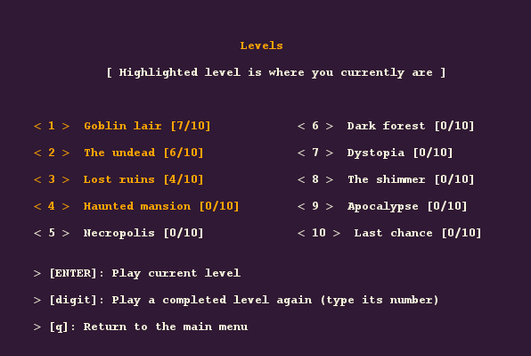

## LDTS_T10G1004 - Get out!

------

This project (for LDTS 2021⁄22) was developed by:

* *Diogo Silva* (*up202004288*@edu.fe.up.pt)
* *Maria Luísa Salvador* (*up202006471*@edu.fe.up.pt)
* *Mariana Teixeira* (*up201905705*@edu.fe.up.pt)

------

### CONTEXT

Nick Heya is the new superhero that arrived to Earth, just in time to stop the purest of the evils, Black Holer, from making our planet to be swallowed! But during their fight, they were trapped in another dimension full of monsters, and Nick has no guns!

In this challenging platform game, help Nick escape alive and collect as many coins as you can so Nick can buy the fastest trip back to Earth! Throughout ten different levels, survive the horrifying monsters and find the keys to 'Get out!'

------

### FEATURES

- **Main menu**
- **Instructions menu**
- **Different levels**
- **Arena space** (the player's environment) for each level, made of platforms and ladders
- **Walking** on the arena's floor or on platforms
- **Climbing** using ladders to reach other platforms
- **Collect coins**
- **Score** (number of coins collected for that level)
- **Different monsters** (goblins, zombies, ghosts)
- **Damage** applied to the hero by monsters
- **Health points**
- **Death** (when the hero's health reaches 0)
- **Quit level** at any moment by pressing 'q'
- **Catch key** (hero can't open the door without it)
- **Open door** to escape/complete a level
- **Progress** (unlocking levels)
- **Final level** where a unique monster (boss) resides
- **Victory screen**
- **Loss screen**

------

### SYMBOLS

```X``` : hero

```$``` : coin

```F``` : key

```0``` : door

```g``` : goblin

```Z``` : zombie

```h``` : ghost

```^~{o,,o}~^``` : boss

------

### CONTROLS

```ArrowUp``` : move up

```ArrowDown``` : move down

```ArrowLeft``` : move left

```ArrowRight``` : move right

```q``` : leave game

------

### IMAGES




------
