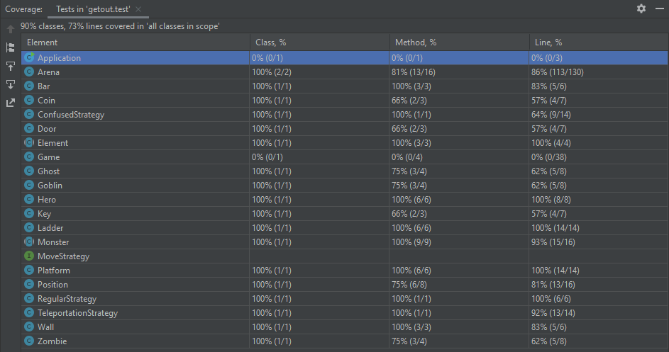
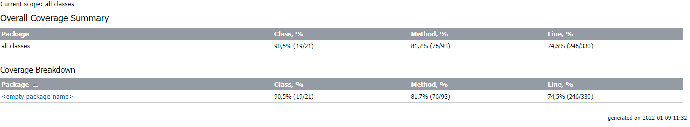

## LDTS_T10G1004 - Get out!

------

This project (for LDTS 2021⁄22) was developed by:

* *Diogo Silva* (*up202004288*@edu.fe.up.pt)
* *Maria Luísa Salvador* (*up202006471*@edu.fe.up.pt)
* *Mariana Teixeira* (*up201905705*@edu.fe.up.pt)

------

### CONTEXT

The present project's goal is to create a 2D video game based on the use of platforms (connected by ladders) to reach elements which allow the player to pass through different levels.

The player must get to the key that opens the correspondent level door without being killed by any of the monsters that roam the platforms in the arena.

Notice that he isn't able to kill monsters as he has no guns, all our hero can do is escape.
Also, there are some coins spread across the arena that can be collected to determine a final score.

------

### IMPLEMENTED FEATURES

> This section contains a list of implemented features and their descriptions.
- **Main menu** - Gives the user the option to play, read the instructions or close the game.

###### Main menu:

- **Instructions menu** - Has a text addressing the game's context and shows the controls.

###### Instructions menu:

- **Different levels** - The game will have 10 levels, each one with its unique arena and combination of monsters.
- **Arena space** - A level has an arena, the player's environment, made of platforms and ladders.
- **Walk** - The hero can walk on the arena's floor or on platforms by pressing arrow left key or arrow right key. However, he is not allowed to walk beyond the tips.
- **Climb** - The hero can use ladders to move up or down to other platforms by pressing arrow up key or arrow down key.

###### Climbing:

- **Collect coins** - When the hero gets a coin, he collects it and the correspondent level score increases.
- **Score** - Equivalent to the number of coins collected for a level. Each level's max score is 10 and a score made is only recorded for that level if the player passes it.
- **Different monsters** - Monsters only exist on platforms and have 3 types, goblins, zombies and ghosts. Each type possesses a different way of moving and does distinct amounts of damage.

###### Different monsters:

- **Damage** - Is applied to the hero by monsters and is subtracted to his health points.
- **Health points** - This value represents the health of our hero and is set to 20 at the beginning of each level.
- **Death** - The hero dies when all his health points are lost by taking damage from the monsters.
- **Quit level** - The user can leave a level at any moment by pressing 'q'.
- **Catch key** - The hero must collect a key (represented by the character 'F') to be able to open the corresponding door.
- **Open door** - The hero, having collected the key, may open the door (represented by the character 'O') to escape/complete that level.
- **Progress** - The hero starts his journey at level 1. By completing a level, the next one is unlocked and progress is therefore made, being recorded on the levels' menu.

###### Progress:

- **Final level** - The last level (n. 10) will contain a "boss", a monster much more dangerous that the previous ones.

###### Final level:

- **Victory screen** - When the player completes a level, the screen changes and a congratulatory message shows up.

###### Victory screen:

- **Loss screen** - When the player dies, the screen changes and a game over message shows up.

###### Loss screen:

------

### PLANNED FEATURES

> This section is similar to the previous one but lists the features that are not yet implemented.
- All the planned features were successfully implemented except the one involving the addition of textures (in this case, a font) to our game.

------

### DESIGN

> This section is organized in different subsections, each describing a different design problem that we had to solve during the project.

------

#### EACH MONSTER SHOULD MOVE IN A CERTAIN WAY

**Problem in Context**

There were some aspects to take into account when thinking about how the movement of each type of monster would be implemented.
Despite having to deal with the limitations of each monster's platform, movement was like a "behaviour" of the monster, an action performed by every one of those entities, whose algorithm varied.
At first, each way of moving was implemented inside each monster's class and the design would be cleaner if there was a way to provide different implementations separately.

**The Pattern**

We have applied the **Strategy** pattern. This pattern allows you to implement similar behaviours with different classes.
We can choose a unique behaviour for each monster movement, having more flexibility.

**Implementation**

The following figure shows how the pattern's roles were mapped to the application classes.

These classes can be found in the following files:

- [com.g1004.getout.element.monster.Monster]()
- [com.g1004.getout.strategy.MoveStrategy]()
- [com.g1004.getout.strategy.RegularStrategy]()
- [com.g1004.getout.strategy.ConfusedStrategy]()
- [com.g1004.getout.strategy.TeleportationStrategy]()

**Consequences**

The use of the Strategy Pattern in the current design allows the following benefits:

- The polymorphism in the interfaces favours the act of choosing between different movement algorithms for the monsters.
- Code is clean because the concerns are separated into classes (a class to each strategy).
- There are now more classes and instances to manage, but still in a reasonable number.

------

#### EACH TYPE OF MONSTER SHOULD BE ABLE TO GENERATE A MOVEMENT FOR ITSELF

**Problem in Context**

A noticeable detail in our code was that all monsters had coordinates (as they are elements) and similar attributes but each type had its only unique way of moving.
This meant all goblins moved the same way (regular movement), all zombies moved the same way (confused movement) and that all ghosts moved the same way (teleportation movement) as well.
Even the boss, which is a special type of monster, has its own way of moving.
So, the optimal solution here would be to implement a dynamic responsible for the generation/creation of distinct types of movement within each monster class.

**The Pattern**

We have applied the **Factory Method** pattern. This pattern allows you to implement subclasses with similar characteristics (entities from the same domain), giving them room to decide how to be specifically generated and which objects they intend to create.
We can create different types of monsters this way, each one with its own instantiations.

**Implementation**

The following figure shows how the pattern's roles were mapped to the application classes.

These classes can be found in the following files:

- [com.g1004.getout.element.monster.Monster]()
- [com.g1004.getout.element.monster.Goblin]()
- [com.g1004.getout.strategy.RegularStrategy]()
- [com.g1004.getout.element.monster.Zombie]()
- [com.g1004.getout.strategy.ConfusedStrategy]()
- [com.g1004.getout.element.monster.Ghost]()
- [com.g1004.getout.strategy.TeleportationStrategy]()
- [com.g1004.getout.strategy.MoveStrategy]()

**Consequences**

The use of the Factory Method Pattern in the current design allows the following benefits:

- The need to bind application-specific classes into the code no longer exists.
- The sub-classes are able to choose the type of objects to create.
- It is clearer that the entities that roam the platforms are "monsters" with similar features but, sometimes, with distinct things to generate.

------

#### (SINGLETON)

**Problem in Context**

(...)

**The Pattern**

We have applied the **Singleton** pattern. (...)

**Implementation**

The following figure shows how the pattern's roles were mapped to the application classes.

These classes can be found in the following files:

- [com.g1004.getout]()

**Consequences**

The use of the Singleton Pattern in the current design allows the following benefits:
 
- (...)

------

#### (FACADE)

**Problem in Context**

(...)

**The Pattern**

We have applied the **Facade** pattern. (...)

**Implementation**

The following figure shows how the pattern's roles were mapped to the application classes.

These classes can be found in the following files:

- [com.g1004.getout]()

**Consequences**

The use of the Facade Pattern in the current design allows the following benefits:

- (...)

------

#### (STATE)

**Problem in Context**

(...)

**The Pattern**

We have applied the **State** pattern. (...)

**Implementation**

The following figure shows how the pattern's roles were mapped to the application classes.

These classes can be found in the following files:

- [com.g1004.getout]()

**Consequences**

The use of the State Pattern in the current design allows the following benefits:

- (...)

------

#### (Builder)

**Problem in Context**

(...)

**The Pattern**

We have applied the **Builder** pattern. (...)

**Implementation**

The following figure shows how the pattern's roles were mapped to the application classes.

These classes can be found in the following files:

- [com.g1004.getout]()

**Consequences**

The use of the Builder Pattern in the current design allows the following benefits:

- (...)

------

#### (Model-View-Controller)

**Problem in Context**

(...)

**The Pattern**

We have applied the **Model-View-Controller** pattern. (...)

**Implementation**

The following figure shows how the pattern's roles were mapped to the application classes.

These classes can be found in the following files:

- [com.g1004.getout]()

**Consequences**

The use of the Model-View-Controller Pattern in the current design allows the following benefits:

- (...)

------

#### KNOWN CODE SMELLS AND REFACTORING SUGGESTIONS

> This section describes different code smells that we have identified in our current implementation, and suggest ways in which the code could be refactored to eliminate them.

------

#### CODE SMELL 1

(...)

------

### GLOBAL DIAGRAM

> This section contains the diagram that represents our project classes and their relationships.

------

### TESTING

Test coverage:

Coverage report:

BetterCodeHub:

(...)

Error-prone:

(...)

------

### SELF-EVALUATION

> This section describes how the work regarding the project was divided between the students.

- Diogo Silva: 40%
- Maria Luísa Salvador: 30%
- Mariana Teixeira: 30%

------