## LDTS_T10G1004 - Get out!

------

This LDTS 2021⁄22 project was developed by:

* *Diogo Silva* (*up202004288*@edu.fe.up.pt)
* *Maria Luísa Salvador* (*up202006471*@edu.fe.up.pt)
* *Mariana Teixeira* (*up201905705*@edu.fe.up.pt)

------

### CONTEXT

The present project's goal is to create a 2D video game based on the use of platforms, connected by ladders, to reach elements which allow the player to pass through different levels.

The player must get the key that opens the correspondent level door, without being killed by any of the monsters that roam the platforms in the arena.

Notice that he isn't able to kill monsters as he has no guns, so all our hero can do is escape.
Also, there are some coins spread across the arena that can be collected to determine a final score.

###### Side note:
- ###### You start the game at level 1 and don't have the option to choose another level to play as you need to pass them one by one to unlock the next. If you desire to immediately test any level at your will, you need to change the value assigned to the attribute "progress" inside the Game class constructor to 10 (which for the Game itself means that you have passed all levels and have access to all of them).

------

### IMPLEMENTED FEATURES

> This section contains a list of implemented features and their descriptions.
- **Main menu** - Gives the user the option to play, read the instructions or close the game.

###### Main menu:

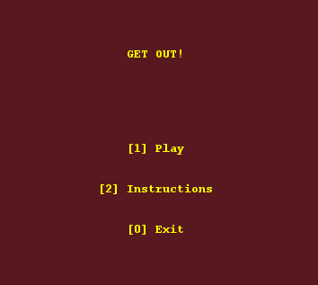

- **Instructions menu** - Has a text addressing the game's context and shows the controls.

###### Instructions menu:

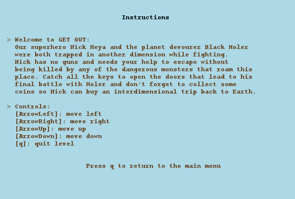

- **Different levels** - The game will have 10 levels, each one with its unique arena and combination of monsters.
- **Arena space** - A level has an arena, the player's environment, made of platforms and ladders.
- **Walk** - The hero can walk on the arena's floor or on platforms by pressing arrow left key or arrow right key. However, he is not allowed to walk beyond the tips.
- **Climb** - The hero can use ladders to move up or down to other platforms by pressing arrow up key or arrow down key.

###### Climbing:

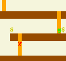

- **Collect coins** - When the hero gets a coin, he collects it and the correspondent level score increases.
- **Score** - Equivalent to the number of coins collected for a level. Each level's max score is 10 and a score made is only recorded for that level if the player passes it.
- **Different monsters** - Monsters only exist on platforms and have 3 types, goblins, zombies and ghosts. Each type possesses a different way of moving and does distinct amounts of damage.

###### Different monsters:

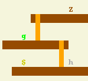

- **Damage** - Is applied to the hero by monsters and is subtracted to his health points.
- **Health points** - This value represents the health of our hero and is set to 20 at the beginning of each level.
- **Death** - The hero dies when all his health points are lost by taking damage from the monsters.
- **Quit level** - The user can leave a level at any moment by pressing 'q'.
- **Catch key** - The hero must collect a key (represented by the character 'F') to be able to open the corresponding door.
- **Open door** - The hero, having collected the key, may open the door (represented by the character '0') to escape/complete that level.
- **Progress** - The hero starts his journey at level 1. By completing a level, the next one is unlocked and progress is therefore made, being recorded on the levels' menu.

###### Progress:

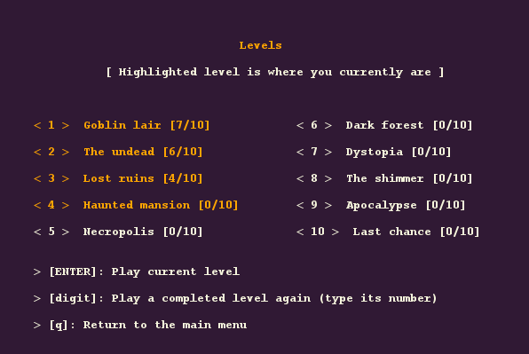

- **Final level** - The last level (n. 10) will contain a "boss", a monster much more dangerous that the previous ones.

###### Final level:

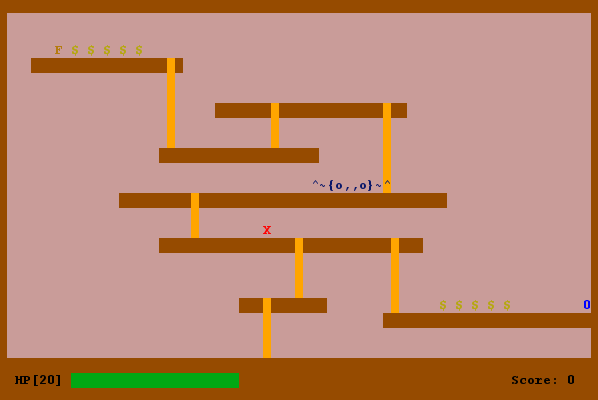

- **Victory screen** - When the player completes a level, the screen changes and a congratulatory message shows up.

###### Victory screen:

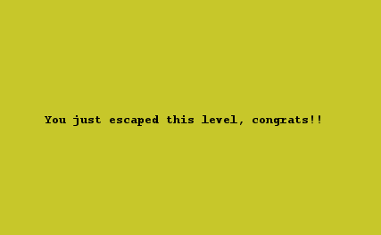

- **Loss screen** - When the player dies, the screen changes and a game over message shows up.

###### Loss screen:

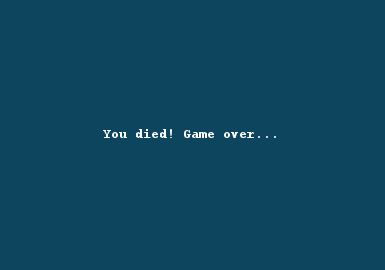

------

### PLANNED FEATURES

> This section is similar to the previous one but lists the features that are not yet implemented.
- All the planned features were successfully implemented except the one involving the addition of textures (in this case, a font) to our game.

------

### DESIGN

> This section is organized in different subsections, each describing a different design problem that we had to solve during the project.

------

#### EACH MONSTER SHOULD MOVE IN A CERTAIN WAY

**Problem in Context**

There were some aspects to take into account when thinking about how the movement of each type of monster would be implemented.
Despite having to deal with the limitations of each monster's platform, movement was like a "behaviour" of the monster, an action performed by every one of those entities, whose algorithm varied.
At first, each way of moving was implemented inside each monster's class and the design would be cleaner if there was a way to provide different implementations separately.

**The Pattern**

We have applied the **Strategy** pattern. This pattern allows you to implement similar behaviours with different classes.
We can choose a unique behaviour for each monster movement, having more flexibility.

**Implementation**

The following figure shows how the pattern's roles were mapped to the application classes.

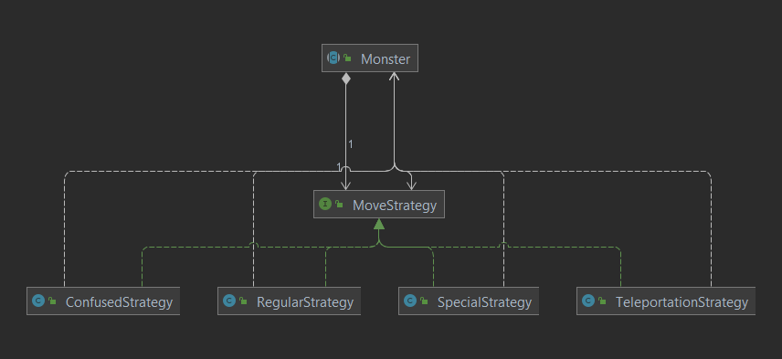

These classes can be found in the following files:

- [Monster](https://github.com/FEUP-LDTS-2021/ldts-project-assignment-g1004/blob/master/src/main/java/com/g1004/getout/element/monster/Monster.java)
- [MoveStrategy](https://github.com/FEUP-LDTS-2021/ldts-project-assignment-g1004/blob/master/src/main/java/com/g1004/getout/strategy/MoveStrategy.java)
- [RegularStrategy](https://github.com/FEUP-LDTS-2021/ldts-project-assignment-g1004/blob/master/src/main/java/com/g1004/getout/strategy/RegularStrategy.java)
- [ConfusedStrategy](https://github.com/FEUP-LDTS-2021/ldts-project-assignment-g1004/blob/master/src/main/java/com/g1004/getout/strategy/ConfusedStrategy.java)
- [TeleportationStrategy](https://github.com/FEUP-LDTS-2021/ldts-project-assignment-g1004/blob/master/src/main/java/com/g1004/getout/strategy/TeleportationStrategy.java)
- [SpecialStrategy](https://github.com/FEUP-LDTS-2021/ldts-project-assignment-g1004/blob/master/src/main/java/com/g1004/getout/strategy/SpecialStrategy.java)

**Consequences**

The use of the Strategy Pattern in the current design allows the following benefits:

- The polymorphism in the interfaces favours the act of choosing between different movement algorithms for the monsters.
- Code is clean because the concerns are separated into classes (a class to each strategy).
- There are now more classes and instances to manage, but still in a reasonable number.

------

#### EACH TYPE OF MONSTER SHOULD BE ABLE TO GENERATE A MOVEMENT FOR ITSELF

**Problem in Context**

A noticeable detail in our code was that all monsters had coordinates (as they are elements) and similar attributes but each type had its only unique way of moving.
This meant all goblins moved the same way (regular movement), all zombies moved the same way (confused movement) and that all ghosts moved the same way (teleportation movement) as well.
Even the boss, which is a special type of monster, has its own way of moving.
So, the optimal solution here would be to implement a dynamic responsible for the generation/creation of distinct types of movement within each monster class.

**The Pattern**

We have applied the **Factory Method** pattern. This pattern allows you to implement subclasses with similar characteristics (entities from the same domain), giving them room to decide how to be specifically generated and which objects they intend to create.
We can create different types of monsters this way, each one with its own instantiations.

**Implementation**

The following figure shows how the pattern's roles were mapped to the application classes.

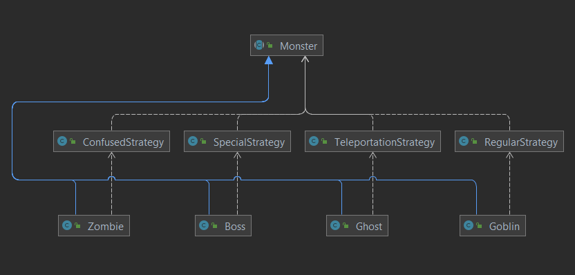

These classes can be found in the following files:

- [Monster](https://github.com/FEUP-LDTS-2021/ldts-project-assignment-g1004/blob/master/src/main/java/com/g1004/getout/element/monster/Monster.java)
- [Goblin](https://github.com/FEUP-LDTS-2021/ldts-project-assignment-g1004/blob/master/src/main/java/com/g1004/getout/element/monster/Goblin.java)
- [RegularStrategy](https://github.com/FEUP-LDTS-2021/ldts-project-assignment-g1004/blob/master/src/main/java/com/g1004/getout/strategy/RegularStrategy.java)
- [Zombie](https://github.com/FEUP-LDTS-2021/ldts-project-assignment-g1004/blob/master/src/main/java/com/g1004/getout/element/monster/Zombie.java)
- [ConfusedStrategy](https://github.com/FEUP-LDTS-2021/ldts-project-assignment-g1004/blob/master/src/main/java/com/g1004/getout/strategy/ConfusedStrategy.java)
- [Ghost](https://github.com/FEUP-LDTS-2021/ldts-project-assignment-g1004/blob/master/src/main/java/com/g1004/getout/element/monster/Ghost.java)
- [TeleportationStrategy](https://github.com/FEUP-LDTS-2021/ldts-project-assignment-g1004/blob/master/src/main/java/com/g1004/getout/strategy/TeleportationStrategy.java)
- [Boss](https://github.com/FEUP-LDTS-2021/ldts-project-assignment-g1004/blob/master/src/main/java/com/g1004/getout/element/monster/Boss.java)
- [SpecialStrategy](https://github.com/FEUP-LDTS-2021/ldts-project-assignment-g1004/blob/master/src/main/java/com/g1004/getout/strategy/SpecialStrategy.java)
- [MoveStrategy](https://github.com/FEUP-LDTS-2021/ldts-project-assignment-g1004/blob/master/src/main/java/com/g1004/getout/strategy/MoveStrategy.java)

**Consequences**

The use of the Factory Method Pattern in the current design allows the following benefits:

- The need to bind application-specific classes into the code no longer exists.
- The sub-classes are able to choose the type of objects to create.
- It is clearer that the entities that roam the platforms are "monsters" with similar features but, sometimes, with distinct things to generate.

------

#### THERE SHOULD BE ONLY ONE GAME RUNNING DURING THE WHOLE EXECUTION

**Problem in Context**

During any gameplay of our project, an obvious aspect that came to our minds was that there was always one single instance of the Game class present from start to finish.
This makes sense as, from a logical point of view, the concept of game here is similar to a global entity, a space where the user can interact with the properties of our
code mostly inside the arenas. Therefore, we needed to ensure that the Game class had only one instance with a global point to access it.

**The Pattern**

The **Singleton** pattern deals with this process, but it is considered an anti-pattern. We decided to make the Game's constructor private and instantiate a single
instance within the class itself and then propagate it to places that use the object.

**Implementation**

The following figure shows how the pattern's roles were mapped to the application classes.

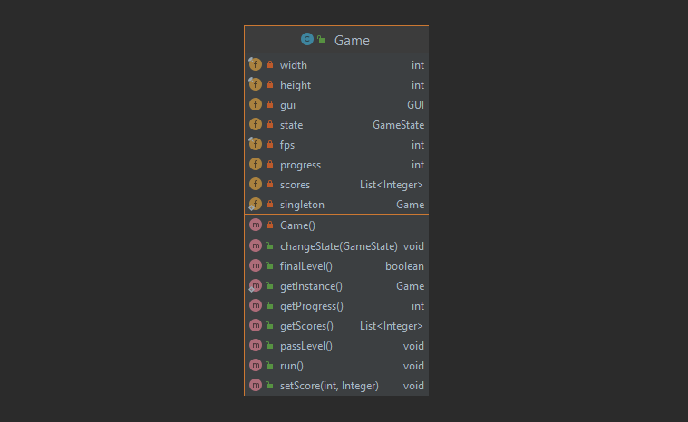

These classes can be found in the following files:

- [Game](https://github.com/FEUP-LDTS-2021/ldts-project-assignment-g1004/blob/master/src/main/java/com/g1004/getout/Game.java)

**Consequences**

The use of this feature in the current design allows the following benefits:
 
- There's a relative level of instance control as this prevents other objects from instantiating their own copies of the considered object, ensuring that all objects 
access the single instance. 
- The class controls the instantiation process, having the flexibility to change the instantiation process.

------

#### THERE SHOULD BE AN ORGANIZED WAY OF DEALING WITH THE GAME SCREEN PROCESSES

**Problem in Context**

This game, being a text-based project, takes advantage of the lanterna library which has a lot of functionalities
with little to no use in our program. Also, it doesn't present us directly with some methods that would be of
great use in specific cases. With that said, we saw the need to implement a feature which could provide us a 
simplified (but limited) interface to this complex library.

**The Pattern**

We have applied the **Facade** pattern. As mentioned before, this provides us with a simplified interface of a
complex system, giving us room to implement the features we need.

**Implementation**

The following figure shows how the pattern's roles were mapped to the application classes.

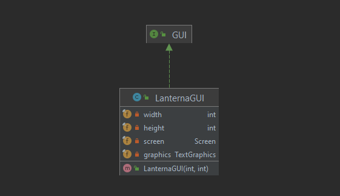

These classes can be found in the following files:

- [GUI](https://github.com/FEUP-LDTS-2021/ldts-project-assignment-g1004/blob/master/src/main/java/com/g1004/getout/gui/GUI.java)
- [LanternaGUI](https://github.com/FEUP-LDTS-2021/ldts-project-assignment-g1004/blob/master/src/main/java/com/g1004/getout/gui/LanternaGUI.java)

**Consequences**

The use of the Facade Pattern in the current design allows the following benefits:

- Makes (in this case) a library easier to use which is good for maintenance and readability.
- It decreases the overall complexity of the application and helps to move unwanted dependencies to one place.

------

#### THE GAME HAS A MENU, INSTRUCTIONS, LEVELS AND GAMEPLAY

**Problem in Context**

For our project, a game instance (with which the user interacts) should take different forms, depending on whether the user
was on the main menu, checking the levels, reading the instructions or playing in the arenas.
So ideally, what we wanted to do was to allow the game object to appear to change its class in run-time.

**The Pattern**

We have applied the **State** pattern. It allows an object to alter its behaviour when its internal state changes.

**Implementation**

The following figure shows how the pattern's roles were mapped to the application classes.

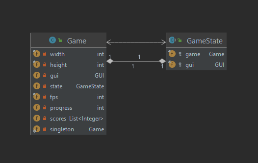

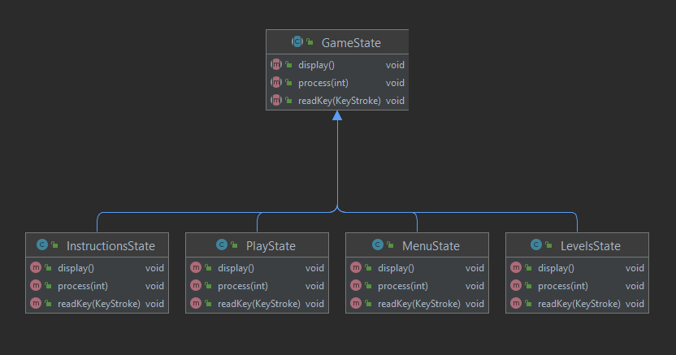

These classes can be found in the following files:

- [Game](https://github.com/FEUP-LDTS-2021/ldts-project-assignment-g1004/blob/master/src/main/java/com/g1004/getout/Game.java)
- [GameState](https://github.com/FEUP-LDTS-2021/ldts-project-assignment-g1004/blob/master/src/main/java/com/g1004/getout/state/GameState.java)
- [MenuState](https://github.com/FEUP-LDTS-2021/ldts-project-assignment-g1004/blob/master/src/main/java/com/g1004/getout/state/MenuState.java)
- [InstructionsState](https://github.com/FEUP-LDTS-2021/ldts-project-assignment-g1004/blob/master/src/main/java/com/g1004/getout/state/InstructionsState.java)
- [LevelsState](https://github.com/FEUP-LDTS-2021/ldts-project-assignment-g1004/blob/master/src/main/java/com/g1004/getout/state/LevelsState.java)
- [PlayState](https://github.com/FEUP-LDTS-2021/ldts-project-assignment-g1004/blob/master/src/main/java/com/g1004/getout/state/PlayState.java)

**Consequences**

The use of the State Pattern in the current design allows the following benefits:

- It localizes and partitions behavior for different states in our code, making it more organized and separating concerns.
- Makes state transitions explicit, while also minimizing conditional complexity, eliminating the need for if and switch 
statements in objects that have different behavior requirements unique to different state transitions.

------

#### ARENAS HAVE DIFFERENT REPRESENTATIONS FOR DIFFERENT LEVELS

**Problem in Context**

The creation of an Arena object requires the placement of unique sets of platforms, ladders, coins, monsters as well as 
different spots for a key and a door. We planned to create 10 distinct arenas for the 10 different levels in our game
and the process of making the decision of which instance of arena to build and to which corresponding level inside
the class seemed a bit messy. So, all we needed was a feature that would allow us to generate different types of an
arena object using similar code.

**The Pattern**

We have applied the **Builder** pattern. It's a creational pattern that lets us construct complex objects step 
by step, allowing us to produce different types and representations of a product using the same construction code.

**Implementation**

The following figure shows how the pattern's roles were mapped to the application classes.

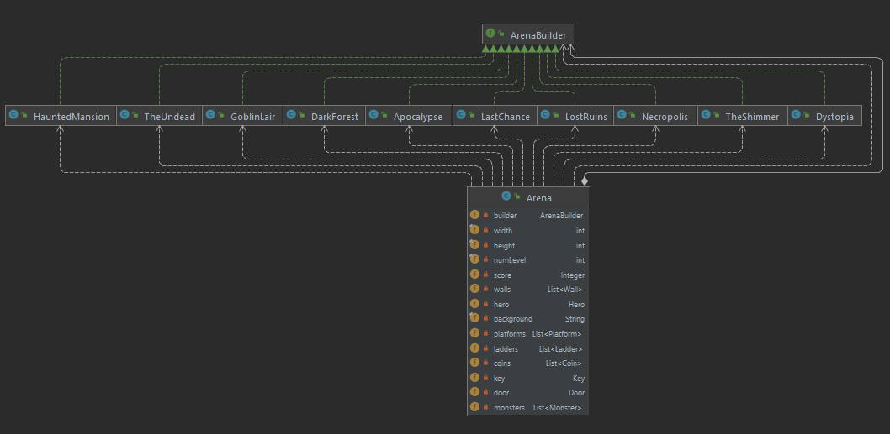

These classes can be found in the following files:

- [Arena](https://github.com/FEUP-LDTS-2021/ldts-project-assignment-g1004/blob/master/src/main/java/com/g1004/getout/MVC/Arena.java)
- [ArenaBuilder](https://github.com/FEUP-LDTS-2021/ldts-project-assignment-g1004/blob/master/src/main/java/com/g1004/getout/MVC/builder/ArenaBuilder.java)
- [GoblinLair](https://github.com/FEUP-LDTS-2021/ldts-project-assignment-g1004/blob/master/src/main/java/com/g1004/getout/MVC/builder/GoblinLair.java)
- [TheUndead](https://github.com/FEUP-LDTS-2021/ldts-project-assignment-g1004/blob/master/src/main/java/com/g1004/getout/MVC/builder/TheUndead.java)
- [LostRuins](https://github.com/FEUP-LDTS-2021/ldts-project-assignment-g1004/blob/master/src/main/java/com/g1004/getout/MVC/builder/LostRuins.java)
- [HauntedMansion](https://github.com/FEUP-LDTS-2021/ldts-project-assignment-g1004/blob/master/src/main/java/com/g1004/getout/MVC/builder/HauntedMansion.java)
- [Necropolis](https://github.com/FEUP-LDTS-2021/ldts-project-assignment-g1004/blob/master/src/main/java/com/g1004/getout/MVC/builder/Necropolis.java)
- [DarkForest](https://github.com/FEUP-LDTS-2021/ldts-project-assignment-g1004/blob/master/src/main/java/com/g1004/getout/MVC/builder/DarkForest.java)
- [Dystopia](https://github.com/FEUP-LDTS-2021/ldts-project-assignment-g1004/blob/master/src/main/java/com/g1004/getout/MVC/builder/Dystopia.java)
- [TheShimmer](https://github.com/FEUP-LDTS-2021/ldts-project-assignment-g1004/blob/master/src/main/java/com/g1004/getout/MVC/builder/TheShimmer.java)
- [Apocalypse](https://github.com/FEUP-LDTS-2021/ldts-project-assignment-g1004/blob/master/src/main/java/com/g1004/getout/MVC/builder/Apocalypse.java)
- [LastChance](https://github.com/FEUP-LDTS-2021/ldts-project-assignment-g1004/blob/master/src/main/java/com/g1004/getout/MVC/builder/LastChance.java)

**Consequences**

The use of the Builder Pattern in the current design allows the following benefits:

- It provides better control over the construction process and a clear separation between the construction and 
representation of an object.
- It supports internal changes on the representation of objects.

------

#### ARENA'S ASPECTS (DATA, MANIPULATION, VISUALIZATION) SHOULD BE SEPARATED INTO INTERCONNECTED SYSTEMS

**Problem in Context**

Having concluded that we had a considerable level of complexity in our code, mainly in the Arena class, we thought it
would be better to separate some main issues into concerns. Given that we've been developing a somewhat complex user 
interface where the Arena class has a model and simultaneously is responsible for both manipulation of its fields and
displaying its properties for the user on screen, the code seemed a bit mixed and harder to deal with.

**The Pattern**

We have applied the **Model-View-Controller** pattern. Well, we didn't apply it to the entirety of our application but 
only a version of it dedicated to the Arena (this is not ideal and is explained below in a side note). This pattern 
separates systems' concerns into three parts (model - represents the data; view - displays the model data; controller - 
interprets user actions and processes data).

**Implementation**

The following figure shows how the pattern's roles were mapped to the application classes.

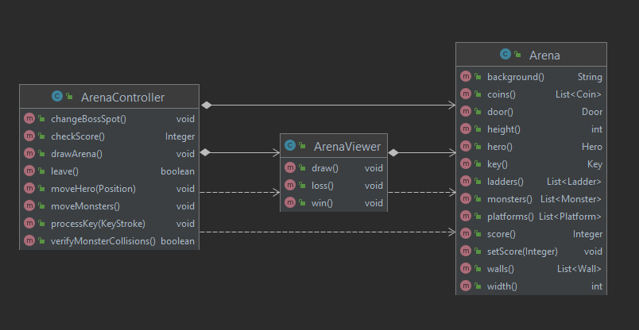

These classes can be found in the following files:

- [Arena](https://github.com/FEUP-LDTS-2021/ldts-project-assignment-g1004/blob/master/src/main/java/com/g1004/getout/MVC/Arena.java)
- [ArenaViewer](https://github.com/FEUP-LDTS-2021/ldts-project-assignment-g1004/blob/master/src/main/java/com/g1004/getout/MVC/ArenaViewer.java)
- [ArenaController](https://github.com/FEUP-LDTS-2021/ldts-project-assignment-g1004/blob/master/src/main/java/com/g1004/getout/MVC/ArenaController.java)

**Consequences**

The use of the Model-View-Controller Pattern in the current design allows the following benefits:

- Makes code easy to manage and maintain.
- Supports quality test-driven development (TDD).
- It allows us to easily apply several modifications.
- Promotes faster and more practical development.

**Side note:**

- Maybe the implementation of this pattern in our project was not ideal. We understand that the Model-View-Controller pattern should be applied to the generality of our classes to have a whole system following this architecture.
The issue was that at first we planned to implement this aspect later in the project and started adding a considerable number of features. So when the time came to add this new pattern we considered that as we had a much more complex
work at that moment it would be a messier job to do this correctly (and unfortunately time was running out a bit), and we ended up applying it exclusively to the Arena class.
- If we had the chance to remake this project, one aspect we would've done differently would be the addition of the Model-View-Controller pattern on an early stage of our code so that the future implementation of new features could be
easier partnered with a more dynamic development.

------

#### KNOWN CODE SMELLS AND REFACTORING SUGGESTIONS

> This section describes different code smells that we have identified in our current implementation, and suggest ways in which the code could be refactored to eliminate them.

------

#### LARGE CLASS

This smell is present in some places on our code, some justifiable other less. The LanternaGUI class is a good example 
where there are a lot of methods but in this case we kept it that way because of the purpose this specific class serves. 
On the other hand, there's the Arena class which in an early stage had a lot of fields (still has) and methods that 
could be somewhat separated into different components. These class being split into distinct classes, one for instance 
dealing with data display and other with data manipulation could be seen as the refactoring process applied here.

------

#### LAZY CLASS

The Bar class, after our projects' full development, has little to no value assigned to it as it does virtually nothing
and only serves as a ladder (Ladder class) component. Nevertheless, we have decided to leave the Bar class in our
project at least to represent some coherence with regard to perceiving the building blocks of an arena.

------

#### DUPLICATE CODE

At first there was a code fragment which we realized showed up several times in different places and represented a 
repeated functionality - a set of conditions that checked if an element was present in a platform or a ladder. 
The refactoring behind this involved the creation of two methods, one for Platform and other for Ladder that 
processed information the same way and fulfilled the intended purpose (the hasElement() methods).

------

#### DATA CLASS 

For instance, the sole purpose of the Arena class is to represent data and is basically composed by getters and setters. 
However, in our project this doesn't represent a problem due to the architecture wrapped around the arena system.

------

#### SWITCH STATEMENTS

Our project also contains a complex sequence of if statements inside the ConfuseStrategy class to deal with how a monster 
using this strategy would move. This was a code fragment we had to be careful with as its implementation or even changes 
in it could lead to some trouble.

------

### GLOBAL DIAGRAM

> This section contains the diagram that represents our project classes and their relationships.

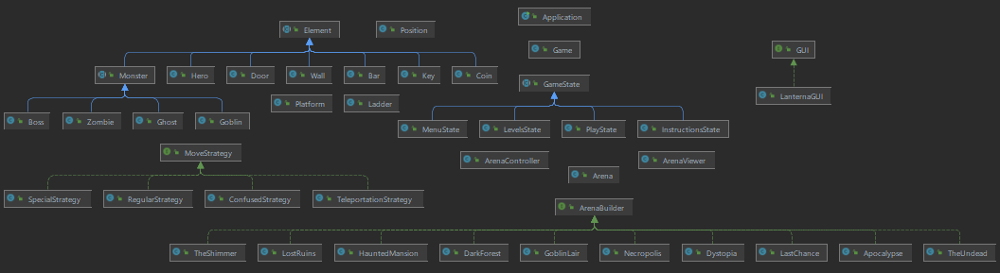

- This image doesn't reveal the dependencies between each class as that would make the image itself illegible.

------

### TESTING

Coverage report:

###### getout package:

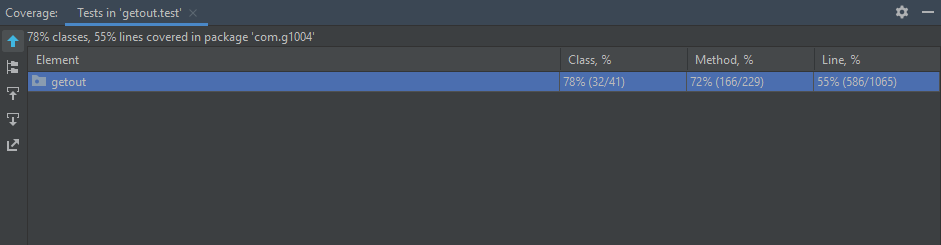

###### General coverage:

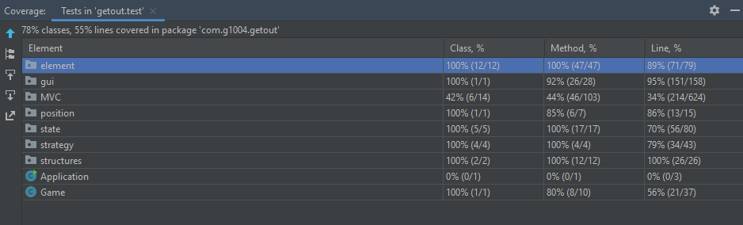

###### element package:

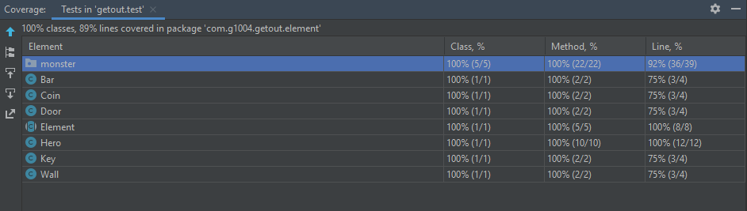

###### monster package:

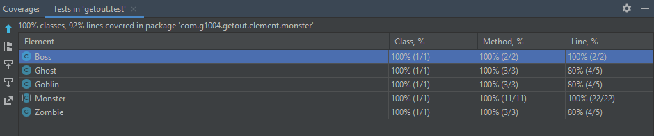

###### gui package:

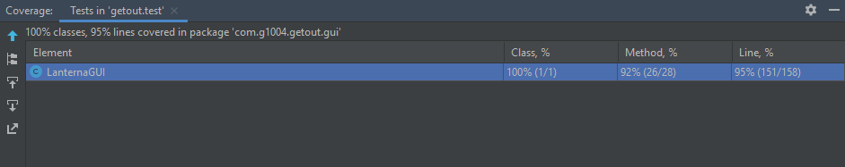

###### MVC package:

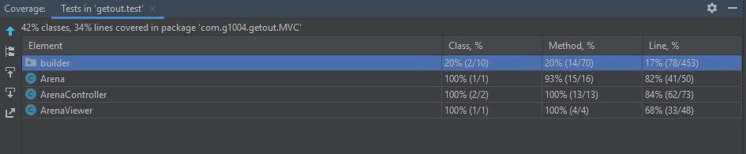

###### position package:

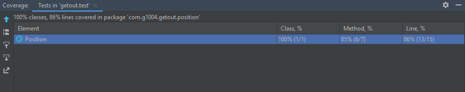

###### state package:

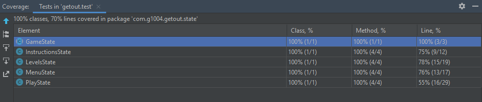

###### strategy package:

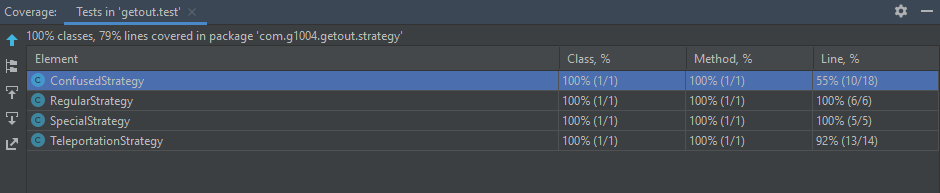

###### structures package:

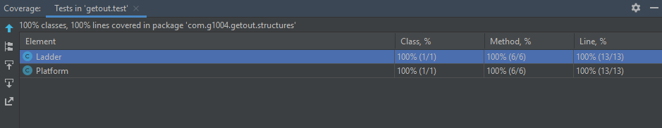

Mutation testing report ([link](https://github.com/FEUP-LDTS-2021/ldts-project-assignment-g1004/tree/master/finalreport/202201280009))

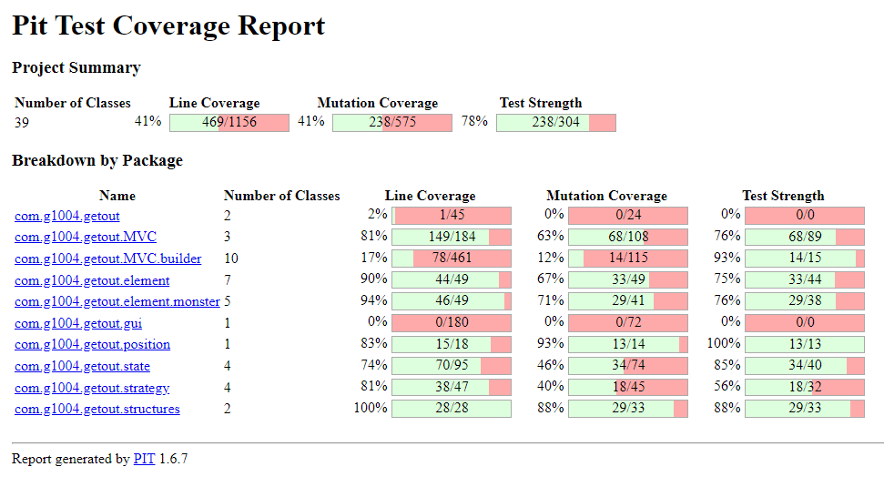

BetterCodeHub:

Some notes:

- We didn't believe creating GUI mocks in LanternaGUITest was a good idea as we wouldn't get objects returned from a screen proving that characters were placed in the respective positions.
Because of that, while executing pitest we had to discard the analysis of this specific test to avoid errors on the build process and so the respective percentages come off as 0.
- A similar concept applies to GameTest but this time a screen is being created inside the private constructor of Game, and we had to disable this one as well.
- There are some classes on the builder package which have 0 coverage mainly because we were short of time and had to create those "basic" classes before the demo, and therefore their tests are missing.
However, these are nothing but a small variation of classes which we tested before, so this situation ends up being less problematic but still a minor flaw.
- Three aspects in our code were not approved in the analyses made on BetterCodeHub. The one related to testing ("Automate Tests") is mostly justified by the topics addressed before. The other two 
("Separate Concerns in Modules" and "Couple Architecture Components Loosely") could probably be improved with a proper implementation of the Model-View-Controller pattern throughout our system.

------

### SELF-EVALUATION

> This section describes how the work regarding the project was divided between the students.

- Diogo Silva: 40%
- Maria Luísa Salvador: 30%
- Mariana Teixeira: 30%

------
