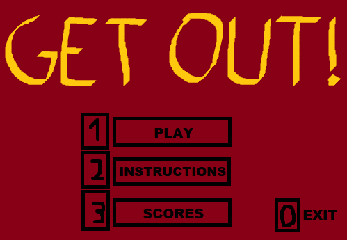

## LDTS_T10G1004 - Get out!

------

The present project's goal is to create a 2D video game based on the use of platforms (connected by ladders) to reach elements which allow the player to pass through different levels.

The player must get to the key that opens the correspondent level door without being killed by any of the monsters that roam the platforms in the arena.

This project was developed by *Diogo Silva* (*up202004288*@edu.fe.up.pt), *Maria Luísa Salvador* (*up202006471*@edu.fe.up.pt) and *Mariana Teixeira* (*up201905705*@edu.fe.up.pt) for LDTS 2021⁄22.

------

### IMPLEMENTED FEATURES

> This section contains a list of implemented features and their descriptions.
- **Arena space** - A level has an arena, the player's environment, made of platforms and ladders.
- **Walking** - The hero can walk on the arena's floor or on platforms by pressing arrow left key or arrow right key. However, he is not allowed to walk beyond the tips.

###### Walking:

- **Climbing** - The hero can use stairs to move up or down to other platforms by pressing arrow up key or arrow down key.

###### Climbing:

- **Getting coins** - When the hero gets a coin, he collects it and the correspondent level score increases.
- **Different monsters** - Monsters only exist on platforms and have 3 types, goblins, zombies and ghosts. Each type possesses a different way of moving.

###### Different monsters:

- **Death** - The hero dies when a monster gets to his coordinates and collides with him or when he simply moves against one of them.
- **Leave game** - For now, the user can leave the game by pressing 'q' or simply closing the console.

------

### PLANNED FEATURES

> This section is similar to the previous one but lists the features that are not yet implemented.
- **Catching key** - The hero can collect the key that lets him open the door.

###### Catching key:

- **Opening door** - The hero, having collected the key, may open the door and reach the next level.

###### Opening door:

- **Health points** - The hero will have health points, dying when that number reaches 0.

###### Health points:

- **Damage** - Each type of monster will take a different amount of health from the hero when colliding with him.

###### Damage:

- **Textures** - The game will have textures in order to look more pleasing.

###### Textures:

- **Different levels** - The game will have 10 levels, each one with its unique arena.

###### Different levels:

- **Main menu** - The user is able to see his progress and play the level where he's currently at.

###### Main menu:

- **Final level** - The last level will contain a "boss", a monster stronger than usual.

###### Final level:

------

### DESIGN

> This section is organized in different subsections, each describing a different design problem that we had to solve during the project.

------

#### EACH MONSTER SHOULD MOVE IN A CERTAIN WAY

**Problem in Context**

There were some aspects to take into account when thinking about how the movement of each type of monster would be implemented.
Despite having to deal with the limitations of each monster's platform, movement was like a "behaviour" of the monster, an action performed by every one of those entities, whose algorithm varied.
At first, each way of moving was implemented inside each monster's class and the design would be cleaner if there was a way to provide different implementations separately.

**The Pattern**

We have applied the **Strategy** pattern. This pattern allows you to implement similar behaviours with different classes.
We can choose a unique behaviour for each monster movement, having more flexibility.

**Implementation**

The following figure shows how the pattern’s roles were mapped to the application classes.

These classes can be found in the following files:

- [Monster]()
- [MoveStrategy]()
- [RegularStrategy]()
- [ConfusedStrategy]()
- [TeleportationStrategy]()

**Consequences**

The use of the Strategy Pattern in the current design allows the following benefits:

- The polymorphism in the interfaces favours the act of choosing between different movement algorithms for the monsters.
- Code is clean because the concerns are separated into classes (a class to each strategy).
- There are now more classes and instances to manage, but still in a reasonable number.

------

#### EACH TYPE OF MONSTER SHOULD BE ABLE TO GENERATE A MOVEMENT FOR ITSELF

**Problem in Context**

A noticeable detail in our code was that all monsters had coordinates (as they are elements) and similar attributes but each type had its only unique way of moving.
This meant all goblins moved the same way (regular movement), all zombies moved the same way (confused movement) and that all ghosts moved the same way (teleportation movement) as well.
So, the optimal solution here would be to implement a dynamic responsible for the generation/creation of distinct types of movement within each monster class.

**The Pattern**

We have applied the **Factory Method** pattern. This pattern allows you to implement subclasses with similar characteristics (entities from the same domain), giving them room to decide how to be specifically generated and which objects they intend to create.
We can create different types of monsters this way, each one with its own instantiations.

**Implementation**

The following figure shows how the pattern’s roles were mapped to the application classes.

These classes can be found in the following files:

- [Monster]()
- [Goblin]()
- [RegularStrategy]()
- [Zombie]()
- [ConfusedStrategy]()
- [Ghost]()
- [TeleportationStrategy]()
- [MoveStrategy]()

**Consequences**

The use of the Factory Method Pattern in the current design allows the following benefits:

- The need to bind application-specific classes into the code no longer exists.
- The sub-classes are able to choose the type of objects to create.
- It is clearer that the entities that roam the platforms are "monsters" with similar features but, sometimes, with distinct things to generate.

------

#### KNOWN CODE SMELLS AND REFACTORING SUGGESTIONS

> This section describes different code smells that we have identified in our current implementation, and suggest ways in which the code could be refactored to eliminate them.

------

#### CODE SMELL 1

(...)

------

### TESTING

(to do:
Screenshot of coverage report.
Link to mutation testing report.)

------

### SELF-EVALUATION

> This section describes how the work regarding the project was divided between the students.

- Diogo Silva: ...%
- Maria Luísa Salvador: ...%
- Mariana Teixeira: ...%

------